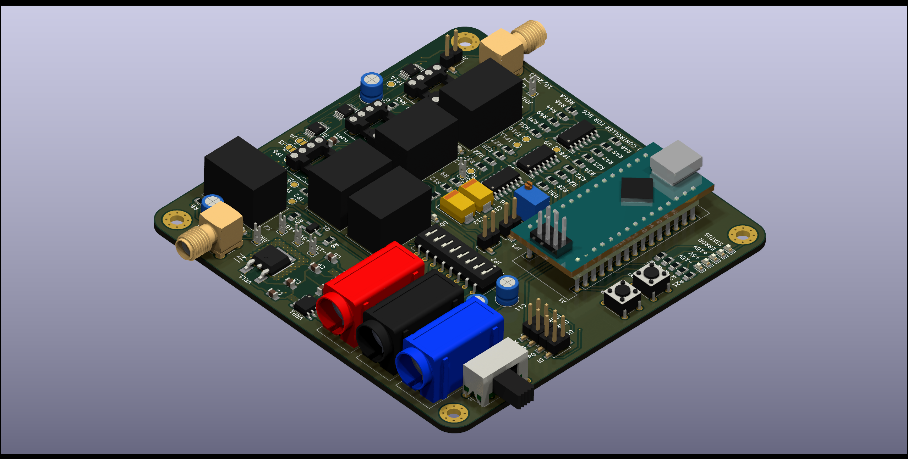

# Digitally tuned analog PID controller for BCG system

This repository contains KiCad files, as well as some LTSpice simulations for an experimental digitally tuned PID controller. The controller is designed to be part of a ballistocardiography (BCG) measuring system. In BCG, the function of the heart is measured by th forces caused by movement of the blood as a result of heartbeat. This is in contrast to better known electrocardiography (ECG), where heart function is assessed by measuring electrical signals. Compared to ECG, where the shape of the waveform is more important, in BCG the amplitude of the BCG signal carries important information about the heart's condition. Because BCG measures physical force, the patient's mass, among other things, can influence the amplitude of the signal. This makes long-term measurements different because the patient's weight and other affecting factors often vary over time. 

This PID controller is a continuation of a project completed Aalto University's Automation and Electrical Engineering Master Programme's Project Work course ([link to project folder](https://wiki.aalto.fi/display/AEEproject/Instrumentation+for+Ballistocardiography+2023?searchId=NLV66OIGJ)). Over the course, a system was implemented where the patient lays on suspended frame. The motion of the suspended frame can be controlled using two solenoids. A load cell is used to measure the position of the frame and a PID controller then controls the solenoids in such a way that the bed frame is kept stationary. This way, when the patient lays motionless, the BCG signal can be aquired from the control signals of the solenoids. This approach keeps the patient's body stationary, effectively canceling body inertia, which normalizes the resultant BCG signal. During the course, an unconventional, analogic PID controller was implemented. The controller was manually tuned using potentiometer which proved unfeasible, as manual tuning was quite diffictult and necessary for each measurement. This project attempts to address this by implementing digital tuning of the P, I and D blocks using digital potentiometers.
